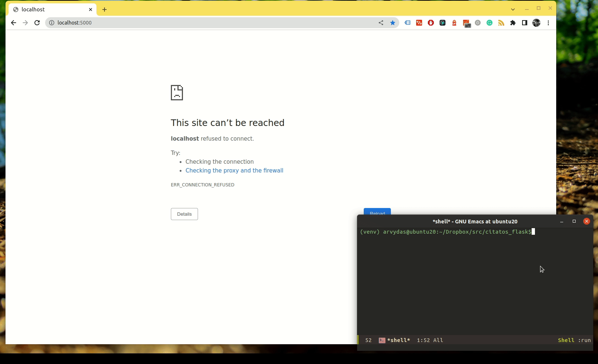

A flask site build to store my all of the quotes that I like.

# Integrated DB

This version of the project is using .db file and flask-sqlalchemy to
store manipulate and present the data.

- Index page shows a random quote on each page refresh.
- You can add a quote
- You can add an author with picture
- You have a list of all authors
- You have a list of all quotes

Learned a lot while building this version of the program.
- Great resource
[here](https://www.digitalocean.com/community/tutorials/how-to-use-flask-sqlalchemy-to-interact-with-databases-in-a-flask-application).
Go to "Populate table" section.

the most difficult things were:
- Wrapping my head around flask-wtf forms and the ingredients to make
  it work
- Feeding one table into another(author drop down list when creating
  new quote)
- Uploading images to static/images folder while saving to the db ONLY
  the uuid+filename
- setting up the migrations to work(due to flask-sqlalchemy deprecated
  versions and so on...)
- creating a functional populate.py file
- with app.app_context(): - what is it, why, when..?
